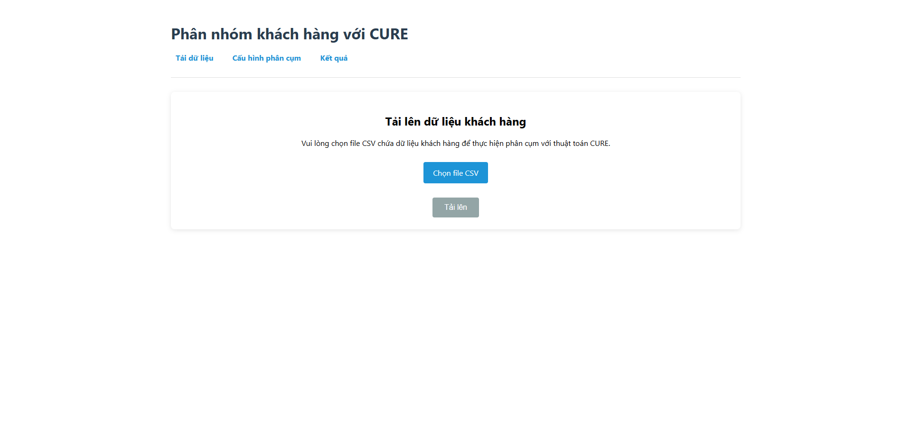
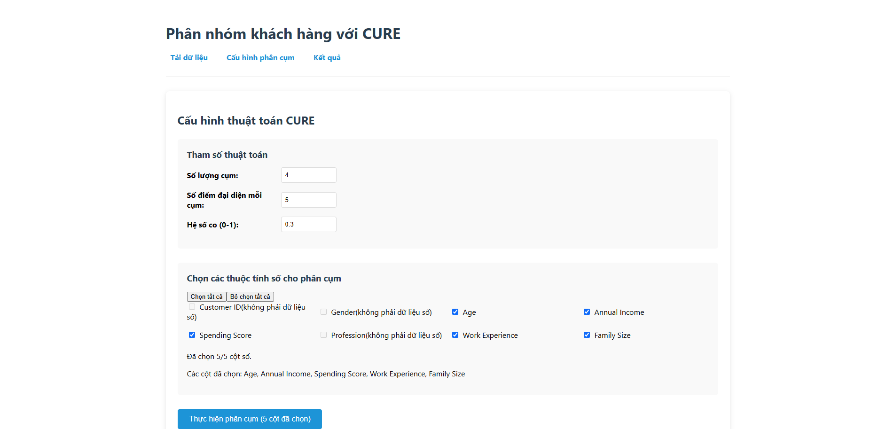
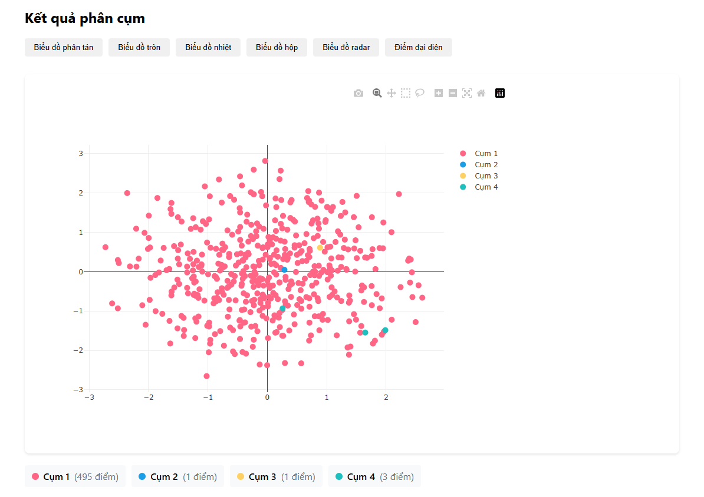

# Phân cụm dữ liệu khách hàng với thuật toán CURE

Ứng dụng web phân nhóm khách hàng nhằm hỗ trợ doanh nghiệp đưa ra các chiến lược marketing phù hợp dựa trên thuật toán CURE.

## Cài đặt

### 1. Cài đặt và kích hoạt môi trường ảo Python

```bash
# Tạo môi trường ảo
python -m venv venv

# Kích hoạt môi trường ảo trên Windows
.\venv\Scripts\Activate.ps1

# Nếu sử dụng Command Prompt thay vì PowerShell
.\venv\Scripts\activate.bat
```

### 2. Cài đặt các dependencies cho Frontend (React)

```bash
# Di chuyển vào thư mục frontend
cd frontend

# Cài đặt các thư viện cần thiết
npm install react-dom react-plotly.js axios papaparse
```

### 3. Cài đặt các thư viện Python

```bash
# Đảm bảo môi trường ảo đã được kích hoạt (có prefix (venv) trước dòng lệnh)
# Cài đặt các thư viện Python cần thiết
pip install fastapi uvicorn pandas numpy scikit-learn python-multipart pyclustering

# Kiểm tra cài đặt thành công
pip list
```

## Khởi động ứng dụng

### 1. Chạy file main.py

### 2. Khởi động Frontend

```bash
# Di chuyển vào thư mục frontend
cd frontend

# Trong thư mục cure
npm run dev
```
Ứng dụng React sẽ chạy tại địa chỉ: http://localhost:5173

## Giao diện ứng dụng





## Xử lý lỗi thường gặp

### Môi trường ảo

1. Nếu gặp lỗi "không thể chạy script" khi kích hoạt môi trường ảo trên PowerShell:
```powershell
Set-ExecutionPolicy -ExecutionPolicy RemoteSigned -Scope CurrentUser
```

2. Để tắt môi trường ảo:
```bash
deactivate
```
